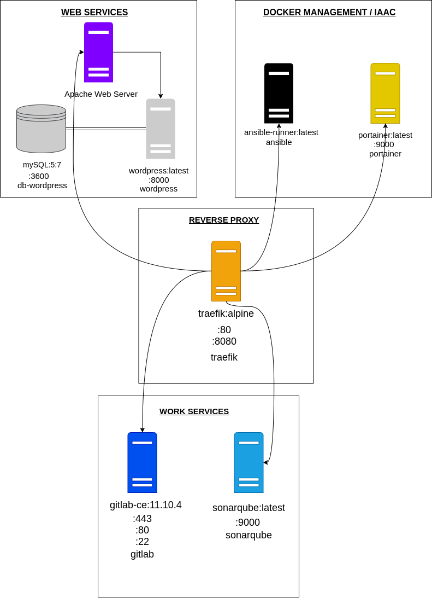

# Infrastructure Architecture

## Requirement

- Docker version >= 18.06.1
- Docker-compose >= v1.22.0

________________________________

## Usage

    1. docker-compose up
It will pull both wordpress and mySQL image in order to initialize the container.

    2. docker-compose down
In order to stop the current container it will down every instance of this container.

    3. docker-composer down --volumes
   
This command will unmount every volumes used for this container and make the instance back to scratch.
________________________________

## Environnement variables

There are some usefull variables used for the database managing.

| mySQL environnement variable |               |
|----------------------------------|---------------|
| MYSQL_ROOT_PASSWORD              | somewordpress |
| MYSQL_DATABASE                   | wordpress     |
| MYSQL_USER                       | wordpress     |
| MYSQL_PASSWORD                   | wordpress     |

| Wordpress environnement variable |           |
|----------------------------------|-----------|
| WORDPRESS_DB_HOST                | db:3306   |
| WORDPRESS_DB_USER                | wordpress |
| WORDPRESS_DB_PASSWORD            | wordpress |
| WORDPRESS_DB_NAME                | wordpress |

________________________________

# Technical Documentation

## Introduction

This project is based on a school project which contain a basical architecture to deploy, maintain and administrate a web service with wordpress and mySQL which are the main components of the web service containers.

## Mandatory requirements

Every component used for this project are using linux containers which requires a Linux kernel distribution such as :
- Linux distribution :
  - Fedora
  - OpenSUSE
  - Arch Linux
  - Linux Mint
  - CentOS
  - Ubuntu
  - Debian

However, this project is using containers to deploy his multiple services, so you'll need to install :

- Docker version >= 18.06
- Docker-compose >= v1.22.0

## Architecture diagram

## Solutions deployed

### Web Services

In order to have an functional application based on a web sevice, we'll be using 3 main components

#### 1. Wordpress

As a CMS *(Content Management System)*, wordpress will be used to serve as a network host in it's own right. We use this solution because it provide us a web template system using a template processor with a front controller and routing all requests for non-static URI's to a sign PHP file which parses he URI and idenifies the target page. his will allow to support human-readable permalinks.

#### 2. mySQL / Apache server

For an efficient data collection, we will be using mySQL which make the deployement with our CMS really easier.
mySQL can be bind with a dashboard which allow us to see every datas stored in the database which improves the maintability of the software.

The wordpress image contains an embed web server in our case it's apache.
It allow us to process incoming network request over HTTP and serveral other protocols. His primary funcion is to store, process and deliver web pages to client.

### Docker Management / IaaC
### Reverse proxy
### Work services

